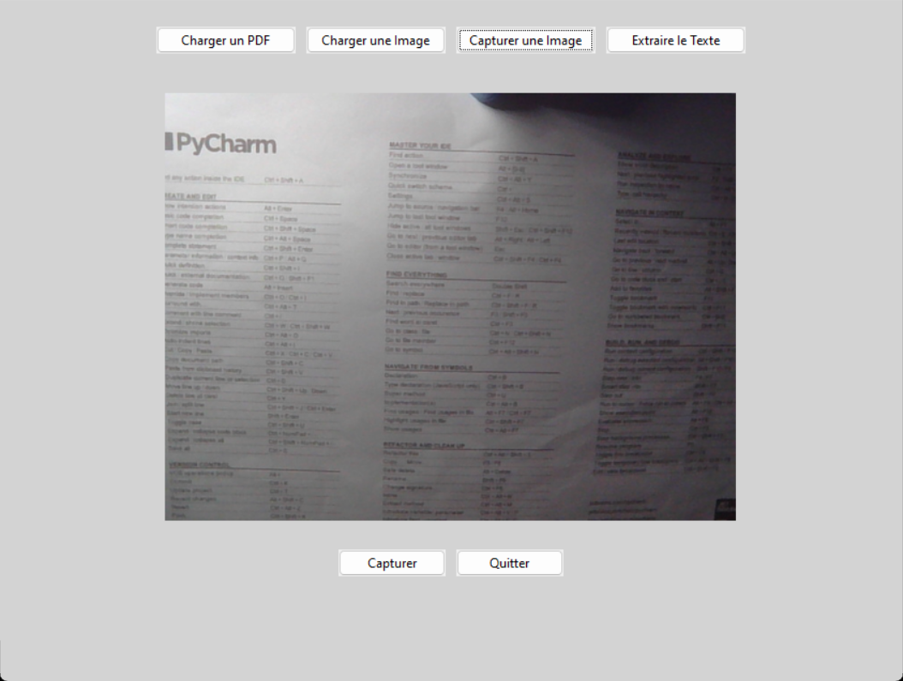

<h1 align="center">Optical Character Recognition (OCR) System</h1>



<p align="center">
  <a href="https://github.com/isabelleysseric/OCR-System">OCR-System</a> (GitHub)
  &nbsp; • &nbsp;<a href="https://github.com/isabelleysseric/OCR-System/wiki">OCR-System</a> (Wiki)<br/>
  <a href="https://github.com/isabelleysseric">isabelleysseric</a> (GitHub)
  &nbsp; • &nbsp;<a href="https://isabelleysseric.com/">isabelleysseric.com</a> (Portfolio)
  &nbsp; • &nbsp;<a href="https://isabelleysseric.ai/">isabelleysseric.ai</a> (Projects)
  &nbsp; • &nbsp;<a href="https://www.linkedin.com/in/isabelleysseric/">isabelleysseric</a> (LinkedIn) <br/>
</p>
<br/>
<br/>


## Author
[Isabelle Eysseric](https://github.com/isabelleysseric)
<br/>
<br/>


## Project Description

OCR System is a Python application that allows you to extract text from PDF documents, uploaded images or images captured via a webcam. The application uses the Tesseract OCR library to recognize and extract text from images or PDF pages.


## Features

- **Load PDF**: Loads a PDF file and extracts the text from each page.
- **Load Image**: Loads an image from the file system and extracts the text.
- **Capture Image**: Captures an image via a webcam and extracts the text.
- **Extract Text**: Saves the extracted text to a `.txt` file, including information about the source (PDF, uploaded image, captured image).


## Prerequisites

Before using the application, make sure you have installed the following dependencies:

- Python 3.7+
- Tkinter (included with standard Python)
- OpenCV (`cv2`)
- NumPy
- Pillow (`PIL`)
- Tesseract-OCR
- PyMuPDF (`fitz`)
- PDF2Image
- PyTesseract


### Installing Tesseract-OCR

1. Download and install Tesseract-OCR from [the official website](https://github.com/tesseract-ocr/tesseract).
2. Add Tesseract to your PATH or specify the path to `tesseract.exe` in the Python script.


### Installing Python Dependencies

You can install the required Python dependencies by running:

```bash
pip install -r requirements.txt
```


## Usage

To start the application, run the main script:

```bash
python gui.py
```


### User Interface

* **Load PDF**: Open a PDF file, convert each page to an image, and then extract the text.
* **Load Image**: Load an image from your file system to extract the text.
* **Capture Image**: Use your webcam to capture an image and extract the text.
* **Analyze Image**: Apply preprocessing to improve text recognition.
* **Extract Text**: Extract text from the selected source (PDF, loaded image, or captured image) and save the extracted text to a `.txt` file.


### Saving results

When extracting text, a `.txt` file is generated, including information about the source of the text:

* `captured_image_extracted_text.txt`: Text extracted from an image captured via webcam.
* `loaded_image_extracted_text.txt`: Text extracted from an uploaded image.
* `loaded_pdf_extracted_text.txt`: Text extracted from an uploaded PDF file.


## # OCR System

## Project Description

OCR System is a Python application that allows you to extract text from PDF documents, uploaded images or images captured via a webcam. The application uses the Tesseract OCR library to recognize and extract text from images or PDF pages.

## Features

- **Load PDF**: Loads a PDF file and extracts the text from each page.
- **Load Image**: Loads an image from the file system and extracts the text.
- **Capture Image**: Captures an image via a webcam and extracts the text.
- **Extract Text**: Saves the extracted text to a `.txt` file, including information about the source (PDF, uploaded image, captured image).

## Prerequisites

Before using the application, make sure you have installed the following dependencies:

- Python 3.7+
- Tkinter (included with standard Python)
- OpenCV (`cv2`)
- NumPy
- Pillow (`PIL`)
- Tesseract-OCR
- PyMuPDF (`fitz`)
- PDF2Image
- PyTesseract

### Installing Tesseract-OCR

1. Download and install Tesseract-OCR from [the official website](https://github.com/tesseract-ocr/tesseract).
2. Add Tesseract to your PATH or specify the path to `tesseract.exe` in the Python script.

### Installing Python Dependencies

You can install the required Python dependencies by running:

```bash
pip install -r requirements.txt
```

## Usage

To start the application, run the main script:

```bash
python gui.py
```

### User Interface

* **Load PDF**: Open a PDF file, convert each page to an image, and then extract the text.
* **Load Image**: Load an image from your file system to extract the text.
* **Capture Image**: Use your webcam to capture an image and extract the text.
* **Analyze Image**: Apply preprocessing to improve text recognition.
* **Extract Text**: Extract text from the selected source (PDF, loaded image, or captured image) and save the extracted text to a `.txt` file.

### Saving results

When extracting text, a `.txt` file is generated, including information about the source of the text:

* `captured_image_extracted_text.txt`: Text extracted from an image captured via webcam.
* `loaded_image_extracted_text.txt`: Text extracted from an uploaded image.
* `loaded_pdf_extracted_text.txt`: Text extracted from an uploaded PDF file.


## Common issues


### `TesseractNotFoundError`

* Make sure Tesseract-OCR is installed and the path to `tesseract.exe` is set correctly in the Python script.


### No text extraction

* Make sure the uploaded image or PDF contains recognizable text. Try improving the image quality or using a higher resolution.


## Contribution

Contributions are welcome! If you have any ideas for improvement, feel free to submit a pull request or open an issue.


## License

This project is licensed under the MIT License. See the [LICENSE](https://github.com/isabelleysseric/OCR-System/blob/master/LICENSE) file for more information.


